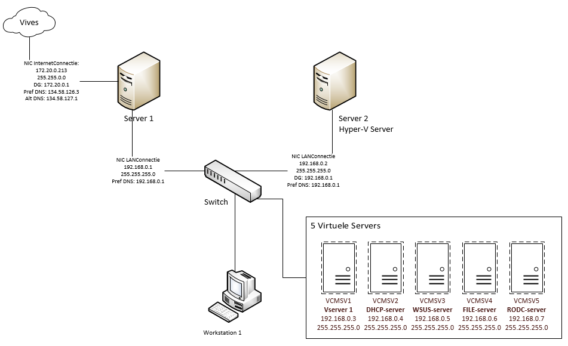

# Windows server

This is the logbook for the Windows Server.  
Navigation to other pages is possible using the sidebar on the left.

This is a project realised by the Vives students:

* Michiel Meyfroodt
* Sybren Maréchal
* Aython Houttekier

Special thanks to our lector Tom Cordemans for helping us troubleshoot and solving different problems.

