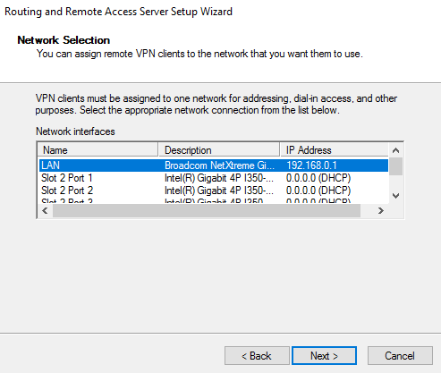

# clients

## Firewall settings

Add the GPO settings to enable the firewall:

* On Domain Profile: 
  * Set Firewall state: on \(recommended\)
  * Inbound connections: Block \(default\)
  * Outbound connections: Allow \(default\)
* On Private Profile:
  * Set Firewall state: on \(recommended\)
  * Inbound connections: Block \(default\)
  * Outbound connections: Allow \(default\)
* On Public Profile:
  * Set Firewall state: on \(recommended\)
  * Inbound connections: Block \(default\)
  * Outbound connections: Allow \(default\)

Next we add the setting that prevents local administrators from applying conflicting rules. Do this on the Domain Profile, Private Profile and Public Profile.

Enable firewall logging:

We want to configure a rule that allows ICMP response types:

