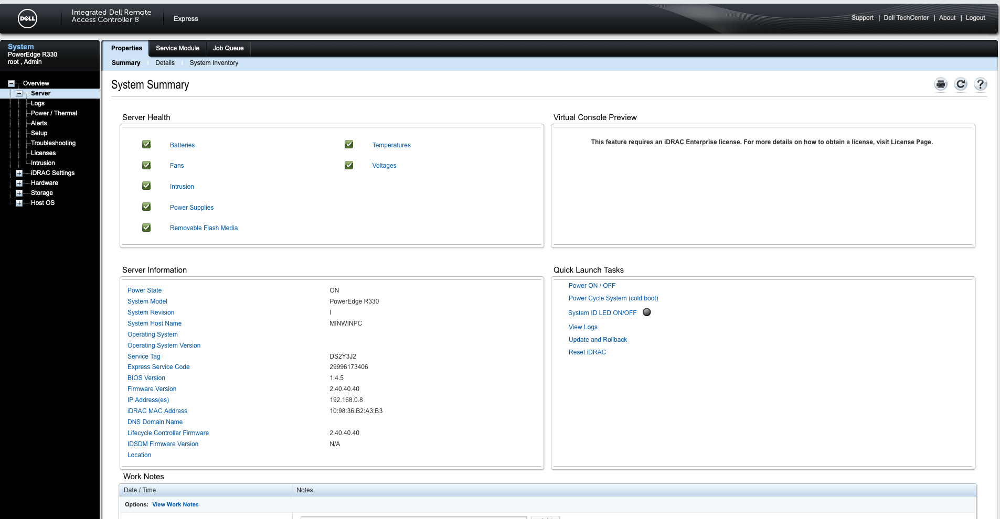

# iDRAC

## iDRAC Installation

To test the working of iDRAC we used another server from the same Dell type.  
To install iDRAC, get in the BIOS of the server and configure a static IPv4 address.

## Testing iDRAC

The next step is testing the working of the iDRAC, we startup our client pc in our network and surf to 192.168.0.8 in Internet Explorer.  
We logged in with the default user 'root' and the default password 'calvin'.

Next, we get the following screen.

As you can see on the image above, we are now able to turn the server on and off.

iDRAC works on the test server, we won't install it in our Network because iDRAC uses the first 2 NIC ports.  
On our Domain Controller, we use the first 2 NIC ports as well.  
The solution should be to configure 2 static IPv4 adresses on the first NIC port.  

