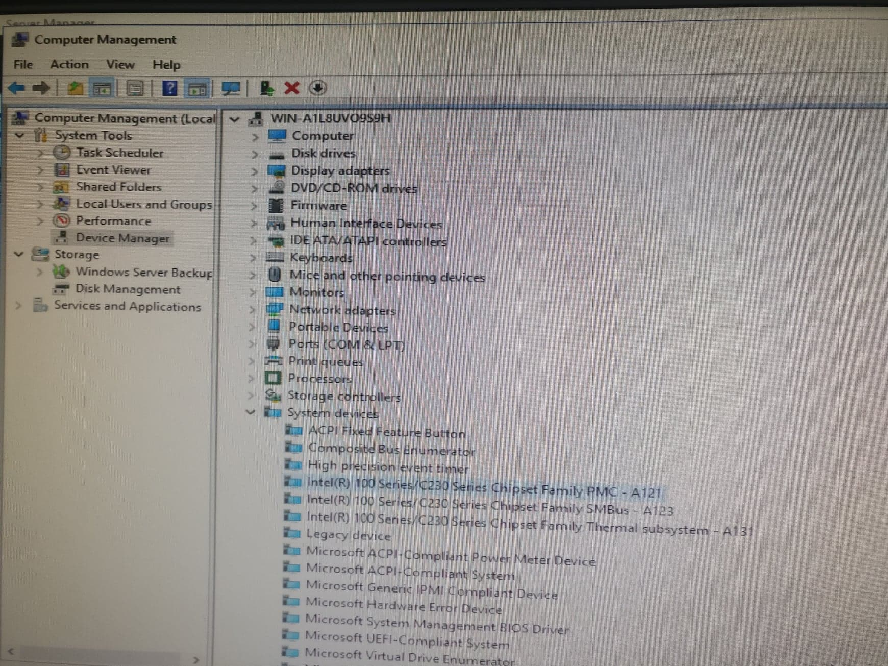

# Installation of the first server

* Allocate 100GB to the primary partition
* Give the Administrator a secure password \(p. 29\)

After the server was completely installed and booted, we decided to check the device manager to see if we had any hardware problems. As you can see, we had a couple of warnings. 

To solve these hardware issues, we had to download some drivers for our type of server \(R330 DRX54J2\)  
We downloaded these drivers on one of our laptops and placed it on a USB.  
Never surf on the internet with your server!

* rename the server to 'CMSV1'

installatie voor netwerk routering

manage

ad roles en featers

role based

vink remote access

fink routing an bij role services

add al featers

install

Tools

Routing and remote acces

CMSV1

rechter muisknop configrue

kies je voor NAT 

Select je WAN

NExt dan LAN

