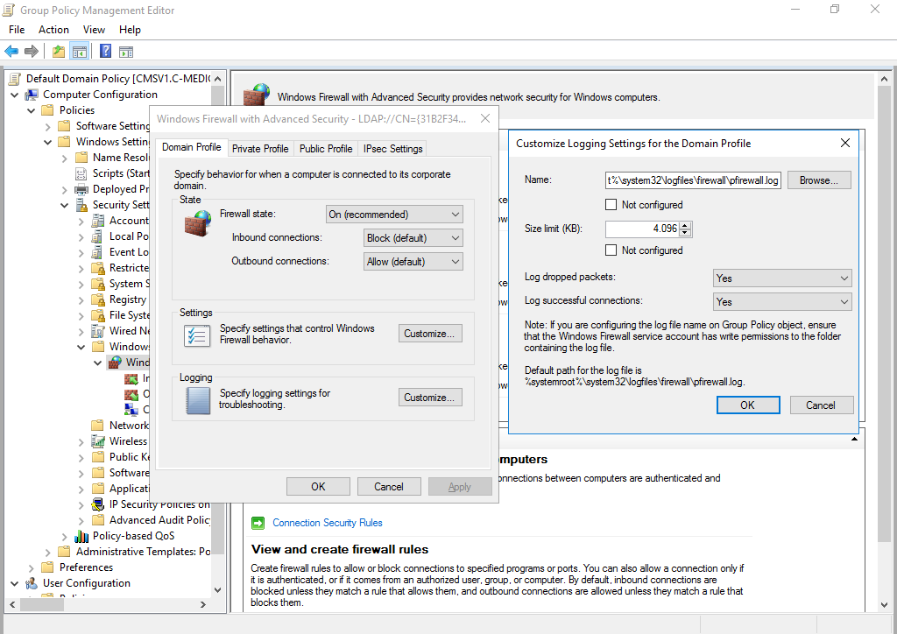
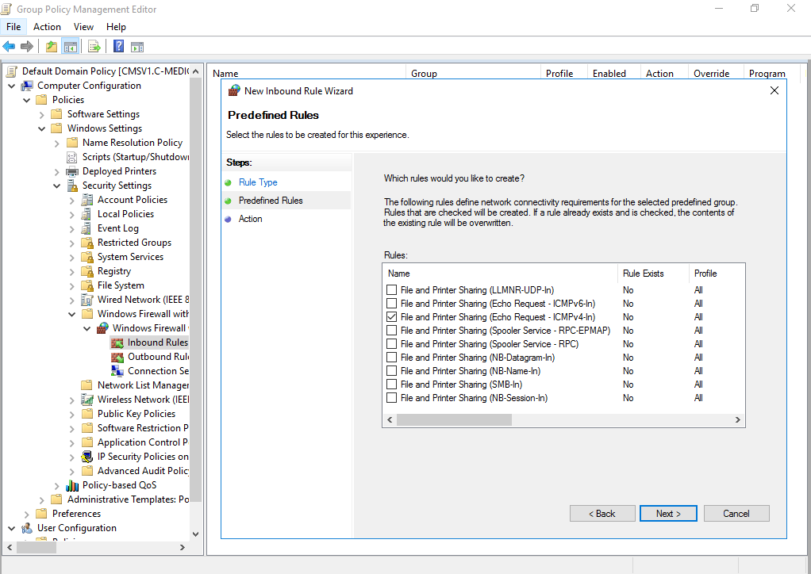

# clients

## Firewall settings

Add the GPO settings to enable the firewall:

* On Domain Profile: 
  * Set Firewall state: on \(recommended\)
  * Inbound connections: Block \(default\)
  * Outbound connections: Allow \(default\)
* On Private Profile:
  * Set Firewall state: on \(recommended\)
  * Inbound connections: Block \(default\)
  * Outbound connections: Allow \(default\)
* On Public Profile:
  * Set Firewall state: on \(recommended\)
  * Inbound connections: Block \(default\)
  * Outbound connections: Allow \(default\)

Next we add the setting that prevents local administrators from applying conflicting rules. Do this on the Domain Profile, Private Profile and Public Profile.

Enable firewall logging:

We want to configure a rule that allows ICMP response types:

## Only allow verified mouses and keyboards \(Rubber Ducky exercise\)

At first, we determined the Hardware ID's from the mouses and keyboards.  
I compared the Hardware ID from 1 Dell mouse with a second one to see which part is the same.  
The same was done for the Hardware ID's of 2 Dell keyboards.

You can see the comparison on the image below:

Some clarification of the abbreviations:

* HID = Hardware ID
* VID = Vendor ID
* PID = Product ID

On the image below you can see the GPO's that I enabed so only verified keyboards and mouses are allowed.

Now follows a list with all the enabled GPO's:

Here you can see the Group Policy Results wizard on CLIENTCOMPUTER1:

