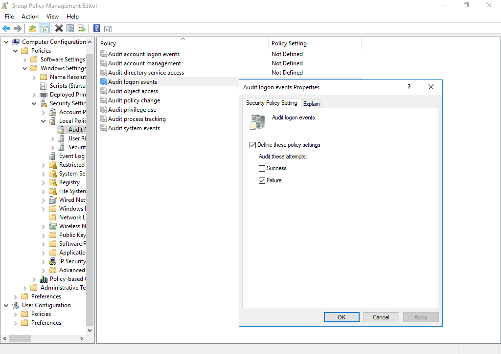
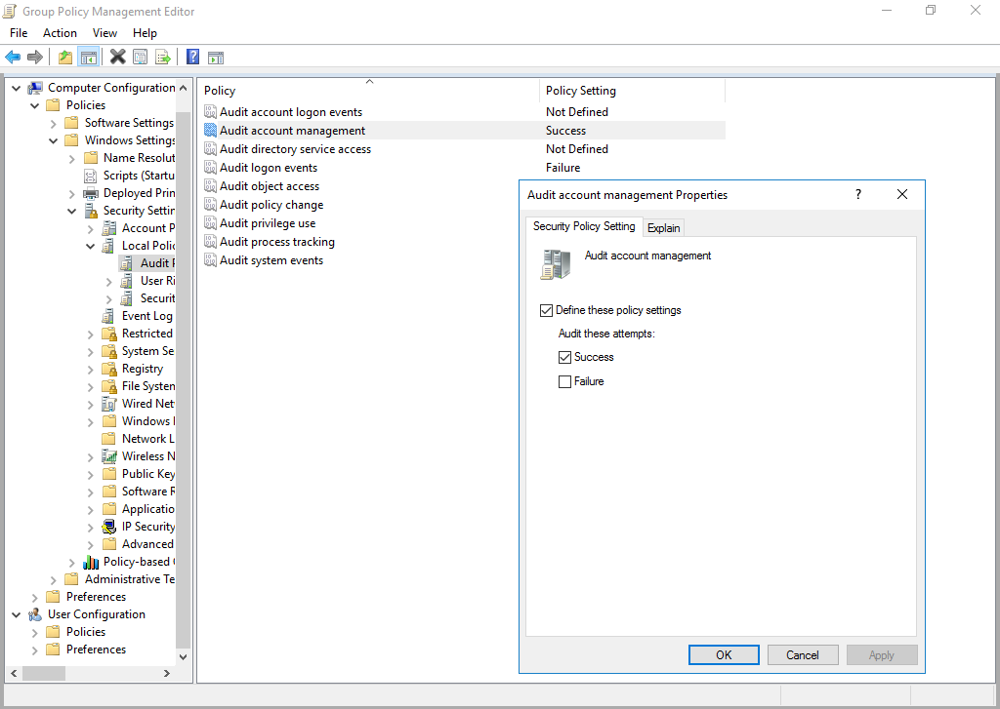
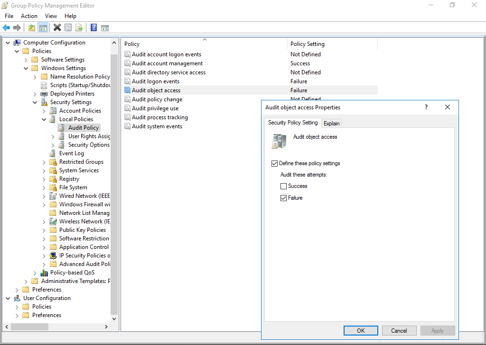
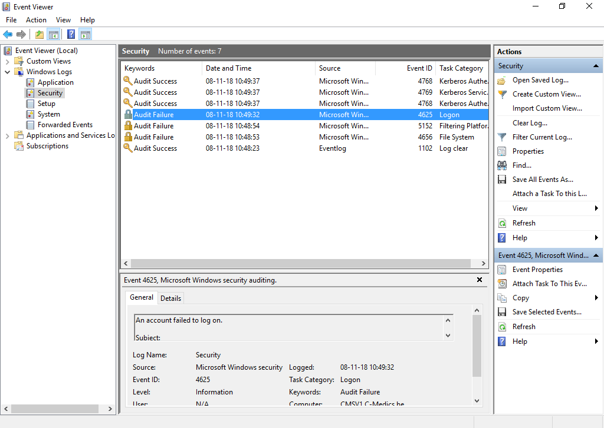

# Default Domain Controllers Policy

## Task 8/11/2018

### Show failed login attempts

To show the failed login attempts, modify the Group Policy 'Audit Policy' in the Default Domain Controllers Policy. Select especially the Audit logon events:

Select Failure because you only want to display the failed login attempts.

### Display changes to accounts and groups

To show the changes to accounts and groups, modify the Group Policy 'Audit Policy' in the Default Domain Controllers Policy. Select especially the Audit account management:

Select success because you only want to see the changes to accounts and groups, not the errors and failures.

### Display failed access to maps and files through the network

To show the failed access to maps and files through the network, modify the Group Policy 'Audit Policy' in the Default Domain Controllers Policy. Select especially the Audit object access:

Select Failure because you only want to display the failed accesses to the different maps and files through the network.

### Event viewer

We can see the different Audit successes and Audit failures in the event viewer.  
I used a wrong password to log in to the domain controller.  
On the image below you can see the Audit failure:

