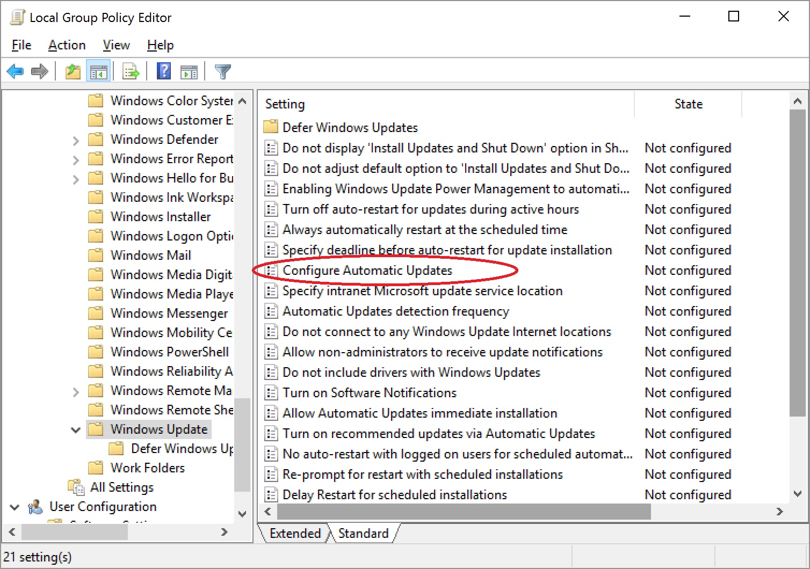

# default domain policy

## Disable IPv6 through group policies

* By default there is no option to disable IPv6 through Group policies, we have to download ADM files and place ADMX and ADML files to below locations in your Windows server.
  * **IPv6Configuration.admx** - Copy this file to **%SYSTEMROOT%\PolicyDefinitions**
  * **IPv6Configuration.adml** - Copy this file to **%SYSTEMROOT&\PolicyDefinitions\**_**en-US**_
* You can download these files using the following link:
  * [http://www.expta.com/IPv6Configuration.zip](http://www.expta.com/IPv6Configuration.zip)
* Now log into the server computer Open Group Policy Management Console \(GPMC\) to configure the IPv6 settings. The new policy will be located under **Computer Configuration &gt; Policies &gt; Administrative Templates &gt; Network &gt; IPv6 Configuration**, as shown below:


                        Then select disable all  
                        Source: [https://social.technet.microsoft.com/wiki/contents/articles/5927.how-to-disable-ipv6-through-group-policy.aspx](https://social.technet.microsoft.com/wiki/contents/articles/5927.how-to-disable-ipv6-through-group-policy.aspx)

You can also do this manually, but this is not recommended because you would have to do this on all devices. When you work through group policies, it is automatisated.

Disable IPv6 using powershell: 

* To start the process I first run the cmdlet below to see If IPv6 Is enabled or disabled:

```text
    Get-NetAdapterBinding -ComponentID 'ms_tcpip6'
```

* To disable Ipv6 on all Interfaces I run the cmdlet below:

```text
Get-NetAdapterBinding -ComponentID 'ms_tcpip6' | disable-NetAdapterBinding -ComponentID ms_tcpip6 -PassThru
```

Source: [https://www.ntweekly.com/2016/09/08/disable-ipv6-on-microsoft-nano-server-2016-using-powershell/](https://www.ntweekly.com/2016/09/08/disable-ipv6-on-microsoft-nano-server-2016-using-powershell/)


## Enable firewall on all devices through Group policies

* Open Group Policy Management Console \(GPMC\) to configure firewall settings. The new policy will be located under **Computer Configuration &gt; Policies &gt; Administrative Templates &gt; Network &gt; Network Connections &gt; Windows Firewall**, as shown below:


* The setting that you need to enable is "**Windows Firewall: Allow inbound remote administration exception**"

  Choose "\*" for all machines


Source: [https://www.lansweeper.com/knowledgebase/firewall/](https://www.lansweeper.com/knowledgebase/firewall/)

## Disabled password caching for IE 11, Edge and chrome

### _Disable password caching for IE 11_

Worked perfectly following this tutorial:  
[https://thycotic.com/company/blog/2013/09/09/securing-web-browsers-through-group-policy/](https://thycotic.com/company/blog/2013/09/09/securing-web-browsers-through-group-policy/)

### _Disable password caching for Edge_

Download the latest version of registry-based **Administrative Templates \(.admx\) for Windows 10 and Windows Server 2016**_._

Run the GUI installer.

Copy   
C:\Program Files \(x86\)\Microsoft Group Policy\Windows 10 and Windows Server 2016 \(Version 2.0\)   
to   
C:\Windows\SYSVOL\sysvol\C-Medics.be

Source: [https://theitbros.com/config-microsoft-edge-settings-using-gpo/](https://theitbros.com/config-microsoft-edge-settings-using-gpo/)

 Disable **“Configure Password Manager”** disable **“Configure Autofill”** policies.


### _Disable password caching for chrome_

First download thes policy templates: [http://dl.google.com/dl/edgedl/chrome/policy/policy\_templates.zip](http://dl.google.com/dl/edgedl/chrome/policy/policy_templates.zip)

Copy chromeos.adml en google.adml to  
       C:\Windows\SYSVOL\sysvol\C-Medics.be\Policies\PolicyDefinitions\en-US  
Copy chromeos.admx en google.admx to  
       C:\Windows\SYSVOL\sysvol\C-Medics.be\Policies\PolicyDefinitions  


Then disable the caching of passwords.  
Source: [https://community.spiceworks.com/topic/2100481-disable-chrome-passwords-through-gpo](https://community.spiceworks.com/topic/2100481-disable-chrome-passwords-through-gpo)  
Source: [https://thycotic.com/company/blog/2013/09/09/securing-web-browsers-through-group-policy/](https://thycotic.com/company/blog/2013/09/09/securing-web-browsers-through-group-policy/)

Open Windows PowerShell and type:

```text
gpupdate /force
```

 This reapplies all policy settings. By default, only policy settings that have changed are applied.


When we try to ping from the desktop pc \(PC1\) to our Domain Controller \(192.168.0.1\), we can see that the ping was successful.

**IMAGE SYBREN**

## Disable automatic updates

Set this one to Disabled.

_If the status for this policy is set to Disabled, any updates that are available on Windows Update must be downloaded and installed manually._



