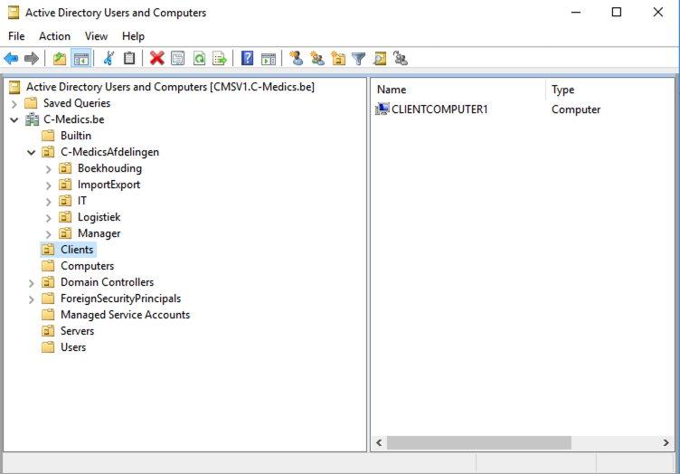

# OU-Structure

* C-Medics.be
  * C-MedicsAfdelingen
    * Boekhouding
    * importExport
    * IT
    * Logistiek
    * Manager
  * Clients
    * ClIENTCOMPUTER1 \(PC1\)
  * Servers
    * CMSV2
    * VCMSV2
    * VCMSV3
    * VCMSV4

