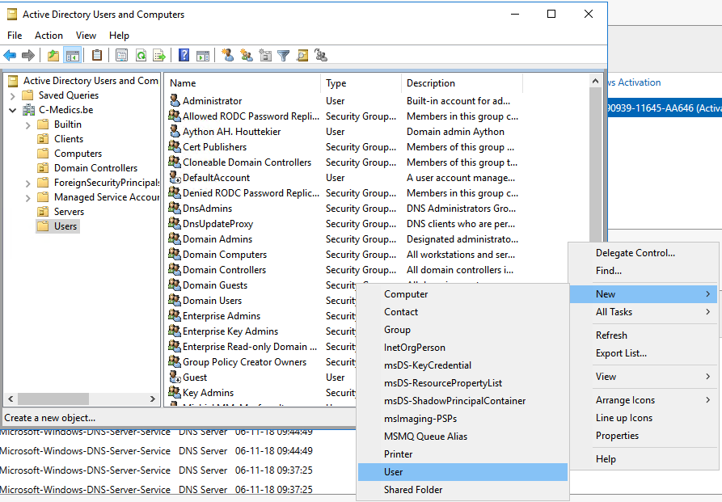
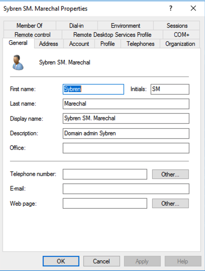
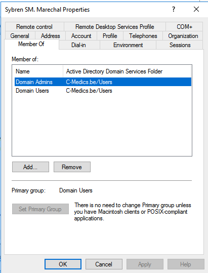
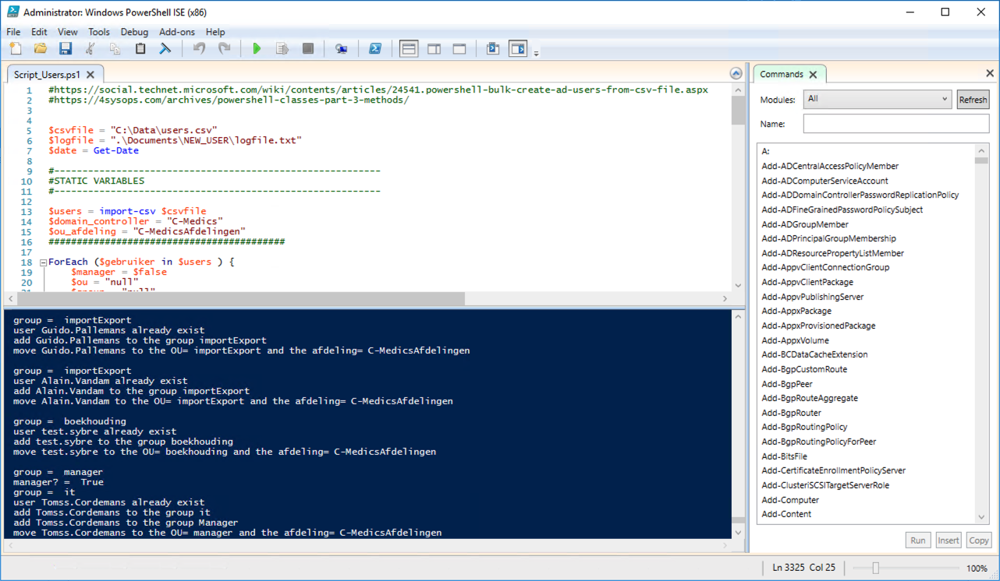

# Users

## Adding Domain Users manualy 

Go to TOOLS =&gt; Active Directory User And Computers  
The Folder "Users".

Greate New User





Add Users to the domain Users group. Go to "Member Of" and add the group of "Domain Users"



## Adding Users Script

### Flowchart

Import of the files and setup van variables

```bash
$csvfile = "C:\Data\users.csv"
$logfile = ".\Documents\NEW_USER\logfile.txt"
$date = Get-Date

#----------------------------------------------------------
#STATIC VARIABLES
#----------------------------------------------------------

$users = import-csv $csvfile
$domain_controller = "C-Medics"
$ou_afdeling = "C-MedicsAfdelingen"
```

Checking the CSV Files for "X" end connect them to the correct group and OU

```bash
if ($gebruiker.Manager.Equals("X")) {
        $ou = "manager" #manager
        $group = "manager" #
        $manager = $true
        write-output "group =  $group" 
        write-output "manager? =  $manager" 
    }
    if ($gebruiker.IT.Equals("X")) {
        $ou = "it" #it
        $group = "it"
        write-output "group =  $group" 
    }
    if ($gebruiker.boekhouding.Equals("X")) {
        $ou = "boekhouding" #boekhouding 
        $group = "boekhouding"
        write-output "group =  $group" 
    }
    if ($gebruiker.logistiek.Equals("X")) {
        $ou = "logistiek" #logistiek
        $group = "logistiek"
        write-output "group =  $group" 
    }
    if ($gebruiker.ImportExport.Equals("X")) {
        $ou = "importExport" # importExport
        $group = "importExport"
        write-output "group =  $group" 
    }
```

Create Users and check 

```bash
try {
        New-ADUser -Name $sam  -OtherAttributes @{'mail' = $gebruiker.Voornaam + "." + $gebruiker.Naam + "@fabrikam.com"; UserPrincipalName = $gebruiker.Account}
        write-output "created user $sam" 
    }
    catch {
        write-output "user $sam already exist" 
    }
```

Check For Managers.   
If manager is true follow the command, else create normal user. and add to the correct Group and OU

```bash
if ($manager.Equals($true)) {
        add-ADGroupMember -Identity $group -Members $sam
        write-output "add $sam to the group $group" 
        add-ADGroupMember -Identity "manager" -Members $sam
        write-output "add $sam to the group Manager" 
        Move-ADobject (get-aduser $sam).DistinguishedName -TargetPath "OU=Manager,OU=$ou_afdeling,DC=$domain_controller,DC=be";
        write-output "move $sam to the OU= manager and the afdeling= $ou_afdeling " 
    }
    else {
        add-ADGroupMember -Identity $group -Members $sam
        write-output "add $sam to the group $group" 
        Move-ADobject (get-aduser $sam).DistinguishedName -TargetPath "OU=$OU,OU=$ou_afdeling,DC=$domain_controller,DC=be";
        write-output "move $sam to the OU= $ou and the afdeling= $ou_afdeling " 
    }
```

### Code



```bash

$csvfile = "C:\Data\users.csv"
$logfile = ".\Documents\NEW_USER\logfile.txt"
$date = Get-Date

#----------------------------------------------------------
#STATIC VARIABLES
#----------------------------------------------------------

$users = import-csv $csvfile
$domain_controller = "C-Medics"
$ou_afdeling = "C-MedicsAfdelingen"
##########################################

ForEach ($gebruiker in $users ) {
    $manager = $false
    $ou = "null"
    $group = "null"
    if ($gebruiker.Manager.Equals("X")) {
        $ou = "manager" #manager
        $group = "manager" #
        $manager = $true
        write-output "group =  $group" 
        write-output "manager? =  $manager" 
    }
    if ($gebruiker.IT.Equals("X")) {
        $ou = "it" #it
        $group = "it"
        write-output "group =  $group" 
    }
    if ($gebruiker.boekhouding.Equals("X")) {
        $ou = "boekhouding" #boekhouding 
        $group = "boekhouding"
        write-output "group =  $group" 
    }
    if ($gebruiker.logistiek.Equals("X")) {
        $ou = "logistiek" #logistiek
        $group = "logistiek"
        write-output "group =  $group" 
    }
    if ($gebruiker.ImportExport.Equals("X")) {
        $ou = "importExport" # importExport
        $group = "importExport"
        write-output "group =  $group" 
    }
    $sam = $gebruiker.Voornaam + "." + $gebruiker.Naam

    try {
        New-ADUser -Name $sam  -OtherAttributes @{'mail' = $gebruiker.Voornaam + "." + $gebruiker.Naam + "@fabrikam.com"; UserPrincipalName = $gebruiker.Account}
        write-output "created user $sam" 
    }
    catch {
        write-output "user $sam already exist" 
    }
    # add member to groop but do not delete it from the pre group
    if ($manager.Equals($true)) {
        add-ADGroupMember -Identity $group -Members $sam
        write-output "add $sam to the group $group" 
        add-ADGroupMember -Identity "manager" -Members $sam
        write-output "add $sam to the group Manager" 
        Move-ADobject (get-aduser $sam).DistinguishedName -TargetPath "OU=Manager,OU=$ou_afdeling,DC=$domain_controller,DC=be";
        write-output "move $sam to the OU= manager and the afdeling= $ou_afdeling " 
    }
    else {
        add-ADGroupMember -Identity $group -Members $sam
        write-output "add $sam to the group $group" 
        Move-ADobject (get-aduser $sam).DistinguishedName -TargetPath "OU=$OU,OU=$ou_afdeling,DC=$domain_controller,DC=be";
        write-output "move $sam to the OU= $ou and the afdeling= $ou_afdeling " 
    }

    $huidigeGroupen = @()
    foreach ($group in Get-ADPrincipalGroupMembership $sam | select name) {
        if ($group.name -ne "Domain Users") {
            $huidigeGroupen += $group.name
        }
    }
                
    foreach ($group in $huidigeGroupen) {
        
        if ($manager.Equals($false)) {
            if ($group -eq $ou) {
            }
            else {
                Remove-ADGroupMember -Identity $group -Members $sam
                write-output "remove $sam from the group= $group  "  
            }
        }
    }
    write-output "============================================" 
    write-output "============================================" 
}


```





## 


