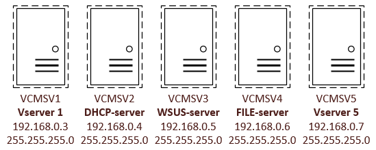
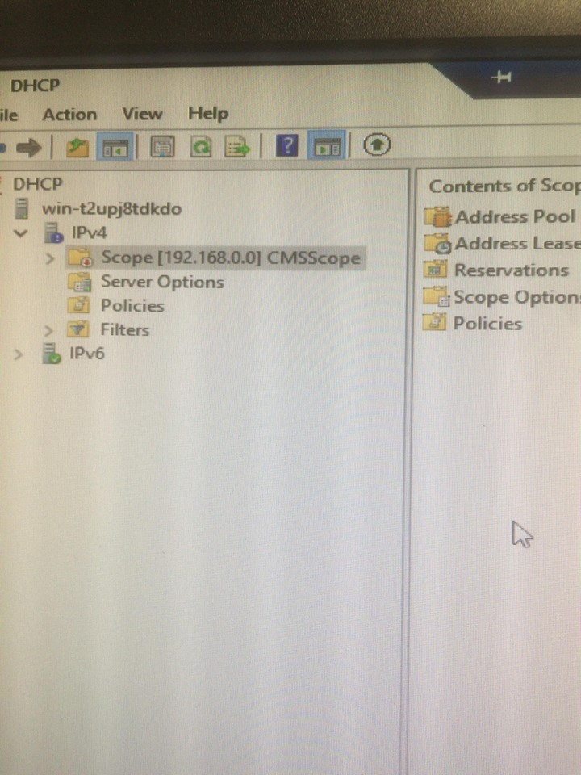

# member server

## Member Server

**CHECK EVENTUELE HARDWARE DEVICES PROBLEMEN!!!!!**

* Enable 'password never expires' for the administrator
* Disable the guest account
* Change the server name to 'CMSV2'
* Make the server member of workgroup 'CMWERKGROEP'

### **Installing hyper-V role**

* making 5 virtual servers on the member server

#### DHCP-server on VCMSV2

* adding the role DHCP
* making a new scope

* setting the lease duration to 2 day

* overview of the scope

#### WSUS-server on VCMSV3

* adding the WSUS-role
* ...

#### FILE-server on VCMSV4

* ...

