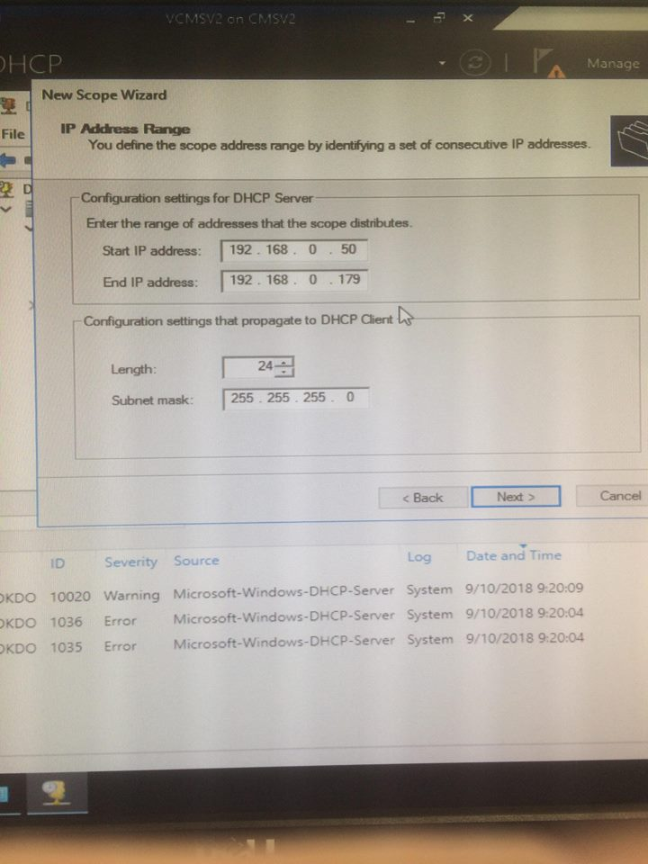
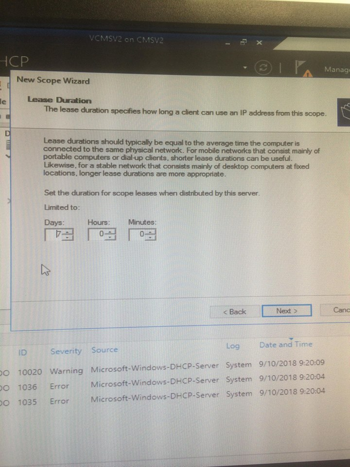

# member server

## Member Server

**CHECK EVENTUELE HARDWARE DEVICES PROBLEMEN!!!!!**

* Enable 'password never expires' for the administrator
* Disable the guest account
* Change the server name to 'CMSV2'
* Make the server member of workgroup 'CMWERKGROEP'

### **Installing hyper-V role**

* making 5 virtual servers on the member server

#### DHCP-server on VCMSV2

* adding the role DHCP
* making a new scope

* setting the lease duration to 1 day

* overview of the scope

#### **red arrow on dhcp**

#### WSUS-server on VCMSV3

* adding the WSUS-role
* Configure the WSUS settings via tools -&gt; WSUS 
  * Before you begin -&gt; next
  * Microsoft Update Improvement Program -&gt; next
  * Choose Upstream Server -&gt; Syncronize from Microsoft Update
  * Specify Proxy Server -&gt; we don't use a proxy server
  * click start Connecting
  * Choose Languages -&gt; English
  * Choose Products -&gt; Windows Defender
  * Choose Classifications -&gt; All Classifications
  * Configure Sync Schedule -&gt; Synchronize manually
  * Finished -&gt; don't select begin initial synchronization and click next
  * then click finish and the Update Services will open
  * 

#### FILE-server on VCMSV4

* ...

**RODC on VCMSV5**

* we install windows server 2016 on this virtual machine and choose for the windows server 2016 datacenter
* When windows server 2016 datacenter is installed you need to configure a passwor for the administrator then you come in the command prompt
* with the command sconfig you come into the sconfig menu.

