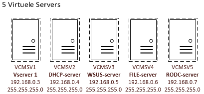

# member server

## Member Server

**CHECK EVENTUELE HARDWARE DEVICES PROBLEMEN!!!!!**

* Enable 'password never expires' for the administrator
* Disable the guest account
* Change the server name to 'CMSV2'
* Make the server member of workgroup 'CMWERKGROEP'

### **Installing hyper-V role**

* making 5 virtual servers on the member server

#### 









