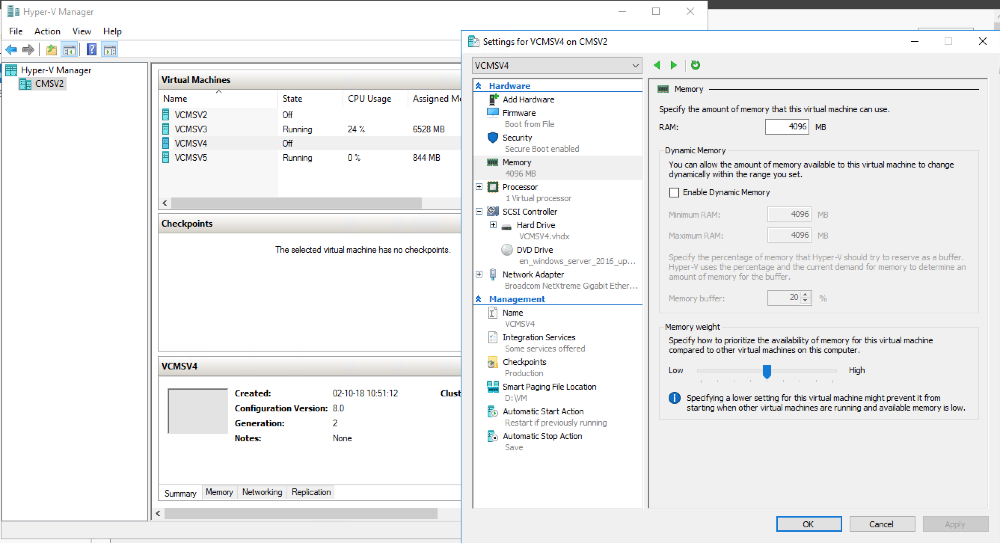
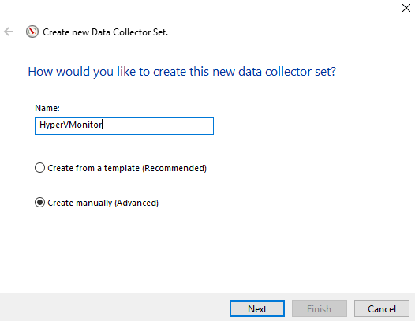

# HYPER V

## Performance Monitor on Hyper V

**Performance Monitor:** 

* _**A Data Collector Set**_ is the building block of performance monitoring and reporting in Windows Performance Monitor. It organizes multiple data collection points into a single component that can be used to review or log performance.
* _**A Data Collector Set**_ can be created and then recorded individually, grouped with other Data Collector Set and incorporated into logs, viewed in Performance Monitor, configured to generate alerts when thresholds are reached, or used by other non-Microsoft applications.
* It can be associated with rules of scheduling for data collection at specific times. Windows Management Interface \(WMI\) tasks can be configured to run upon the completion of Data Collector Set collection.

In Performance Monitor under Data collector sets --&gt; User Defined: New: Data Collector Set.

  
We run this HyperVMonitor for +/- 1 minute. Normally we should let this run for a while to get a nice graph, but due to the small amount of time, we only could this run for one minute.

