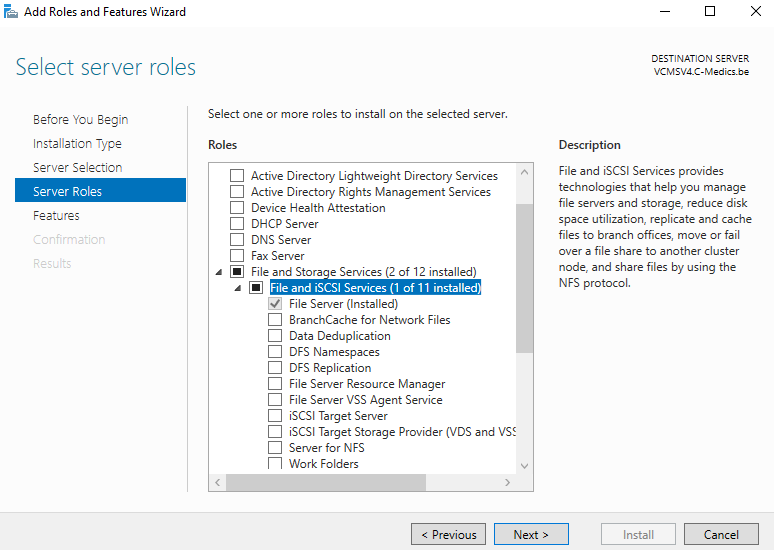

# File-Server

Installing the role File-server

We start to make a share for the UserFolders and the UserProfiles.

We do the same for the UserProfiles 

In the server manager you can check the shares.

