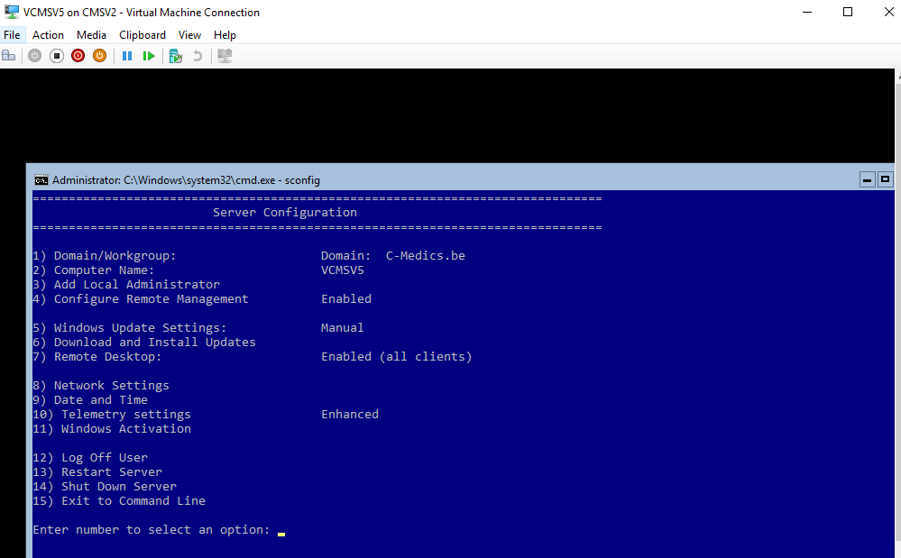
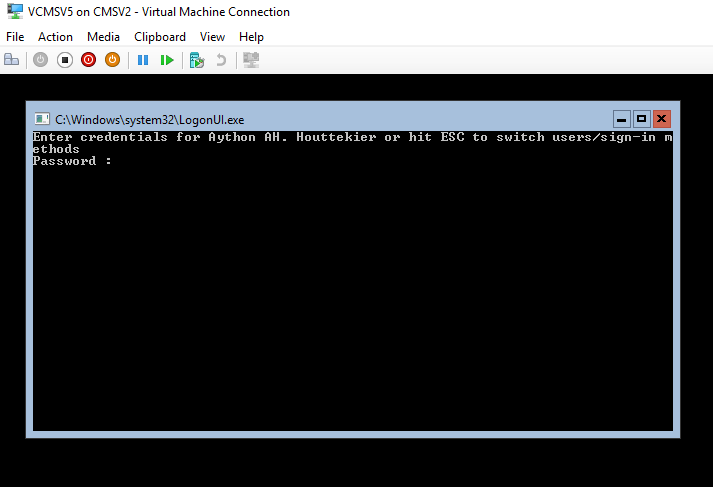

# RODC-Server

**RODC on VCMSV5**

* we install windows server 2016 on this virtual machine and choose for the windows server 2016 datacenter
* When windows server 2016 datacenter is installed you need to configure a password for the administrator then you come in the command prompt
* with the command sconfig you come into the sconfig menu.



Installing the features in powershell window

```text
Add-WindowsFeature AD-Domain-Services, DNS
```

Controlling the windows features

```text
Get-WindowsFeature
```

Testing installation 

```text
Test-ADDSDomainControllerInstallation
```

foto

Creating the RODC \(Read Only Domain Controller\)

```text
Install-ADDSDomainController -InstallDns -DomainName 'C-Medics.be' -ReadOnlyReplica -SiteName 'C-Medics' -WhatIf
```



