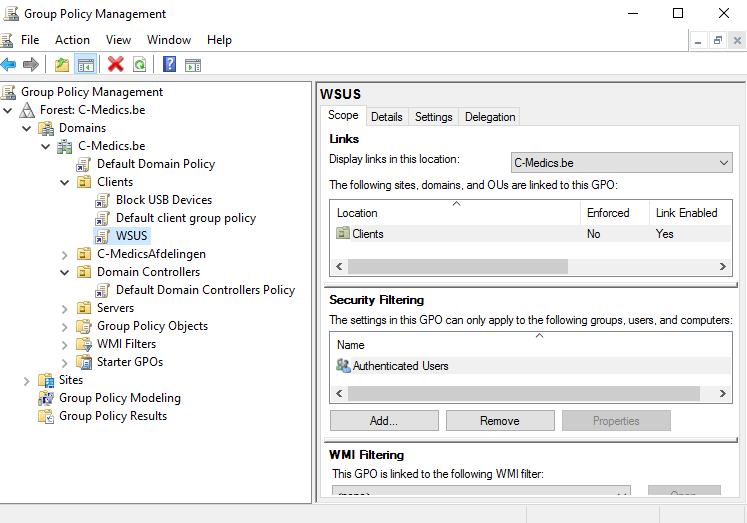
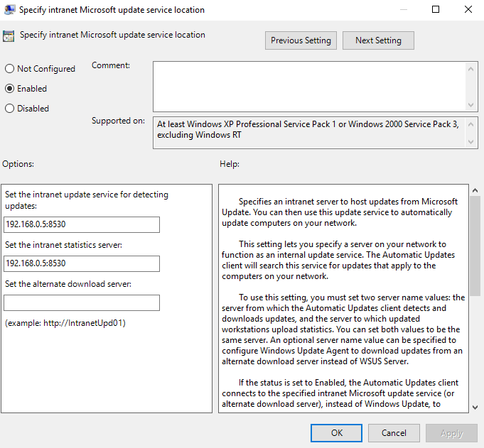
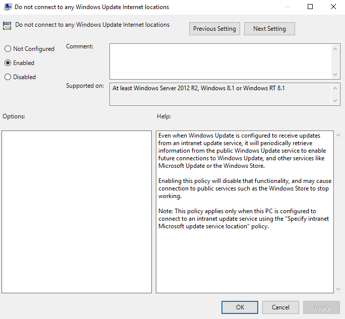

# WSUS-Server

#### WSUS-server on VCMSV3

* adding the WSUS-role
* Configure the WSUS settings via tools -&gt; WSUS 
  * Before you begin -&gt; next
  * Microsoft Update Improvement Program -&gt; next
  * Choose Upstream Server -&gt; Syncronize from Microsoft Update
  * Specify Proxy Server -&gt; we don't use a proxy server
  * click start Connecting
  * Choose Languages -&gt; English
  * Choose Products -&gt; Windows Defender
  * Choose Classifications -&gt; All Classifications
  * Configure Sync Schedule -&gt; Synchronize manually
  * Finished -&gt; don't select begin initial synchronization and click next
  * then click finish and the Update Services will open

We create a policy on the domain controller.

Configuring the policies

