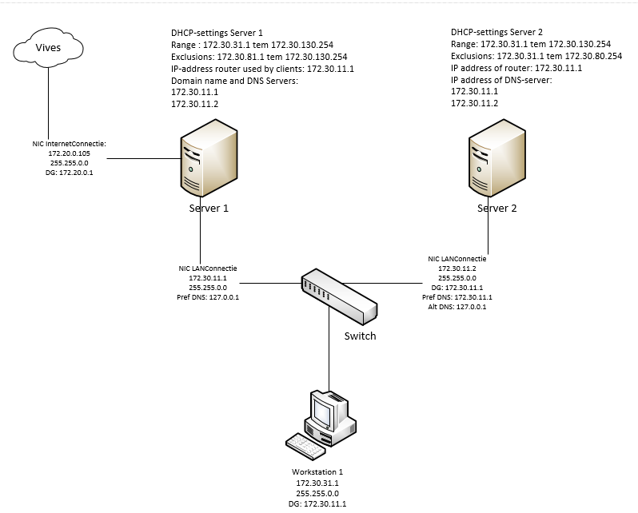

# IP configuration

The scheme with ip configuration

## DOMAIN controller connection

Domain controller   
G0/1 WAN  
IP Address: 172.20.0.213  
SUBNET 255.255.0.0  
DEFAULT GATEWAY 172.20.0.1  
G0/2 LAN

G0/1 WAN  
IP Address: 192.168.0.1  
255.255.255.0  
  
G0/2 LAN

Subnet 192.168.0.0/24

## Member server

G0/1 LAN  
ip address: 192.168.0.2   
Subnet. 255.255.255.0  
def gateway 192.168.0.2   
192.168.0.2 

  

installatie 

