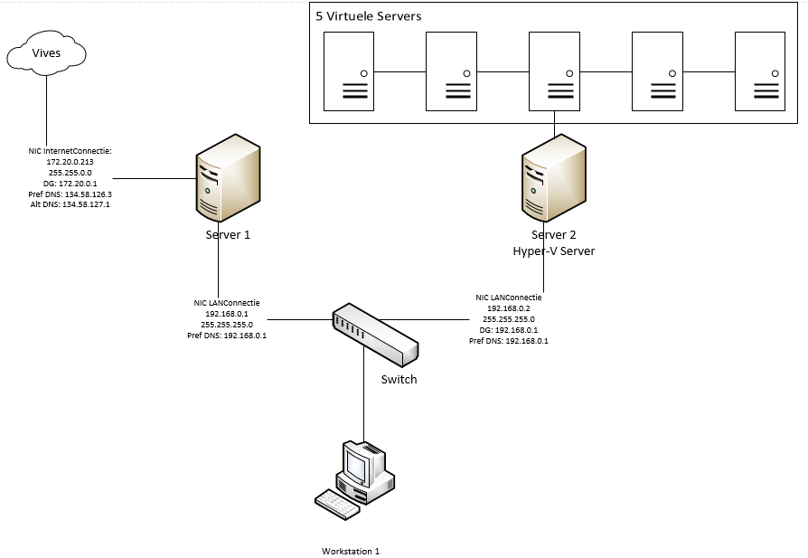

# IP configuration

## DOMAIN controller connection

### netwerk provider

Domain controller   
G0/1 WAN  
IP Address: 172.20.0.213  
SUBNET 255.255.0.0  
DEFAULT GATEWAY 172.20.0.1

### Eigen Netwerk

G0/2 LAN  
IP Address: 192.168.0.1  
255.255.255.0  
Def gateway 192.168.0.1  
DNS 192.168.0.1

## Member server

G0/1 LAN  
ip address: 192.168.0.2   
Subnet. 255.255.255.0  
def gateway 192.168.0.2   
DNS 192.168.0.2 

g0/2 to hyper-V via switch

## PC 1

G0/1 LAN  
ip address: 192.168.0.10   
Subnet. 255.255.255.0  
def gateway 192.168.0.2   
DNS 192.168.0.2 

## VERDELING

192.168.0.1- 192.168.0.9 CONTROLLERS  
192.168.0.10 - 192.168.0.29 COMPUTERS  
192.168.0.30-192.168.0.39 PRINTERS

The scheme with ip configuration

