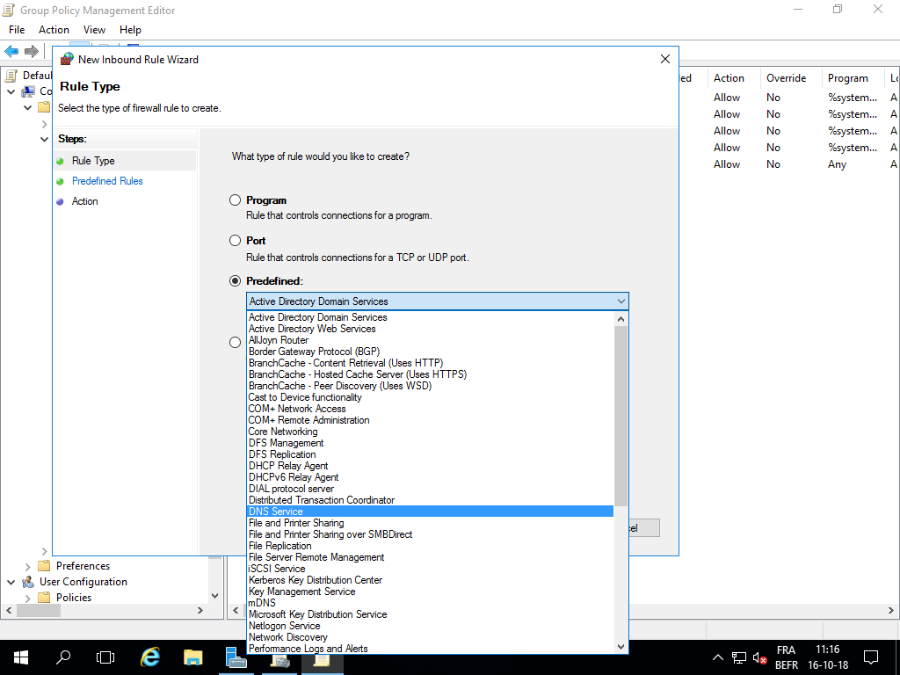
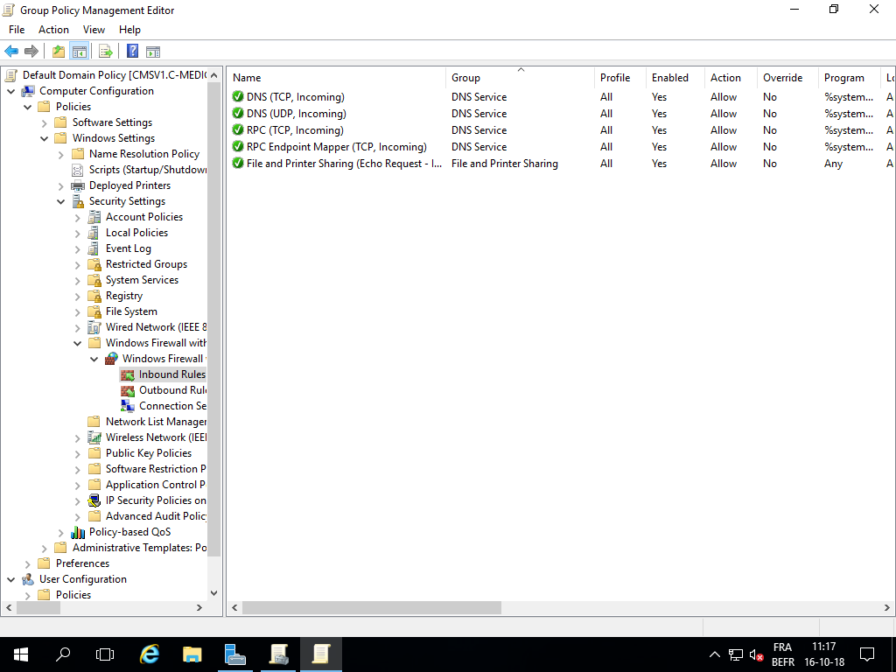

# group policy DNS

## No internet connection

### Problems

No connection to DNS from PC1 and member server

Possible to ping Inside the network and to LAN and WAN. Not possible to DNS. 

### The problem

The firewall domain profile was configured to block by default.

### The solution

Add a predifined inbound rule: the DNS service.

As you can see on the image below, we added the DNS services next to the file and printer sharing.

to change the group policy to an other level. 

Other rules for clients and servers. 

### scope

change the scope of the policy's.   
Create of a group policy for

* default domain policy
* domain controller
* clients
* servers

