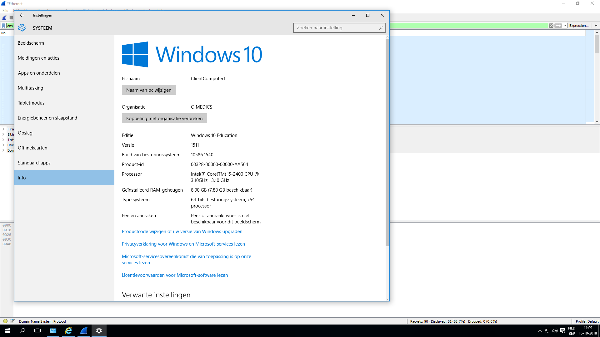

# Making the pc member of the domain

## ClientComputer1

**On the Windows 10** PC go to Settings &gt; System &gt; About then click Join a **domain**.

1. Enter the **Domain** name and click Next. ...
2. Enter account information which is used to authenticate  \(`C-Medics.be` \) on the **Domain** then click OK.
3. Wait while your computer is authenticated on the **Domain**.

On the image below you can see that the pc is now a member of the domain `C-Medics.be`.

